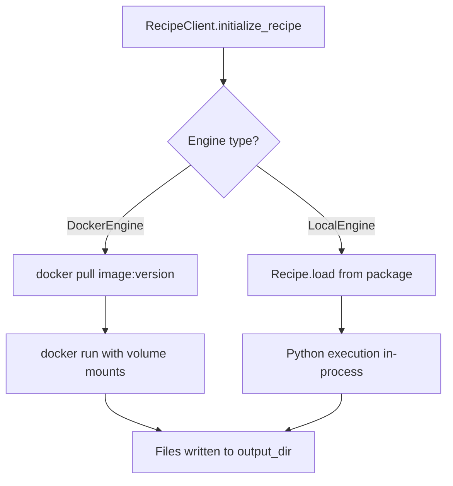

# Docker vs Local Execution

## Overview

nskit supports two execution modes for recipes:

1. **Docker Mode (Default)** — Executes recipes in isolated, versioned containers
2. **Local Mode** — Executes recipes from locally installed packages

The choice of mode has significant implications for recipe updates. Docker mode pins each recipe version as an immutable container image, so nskit can regenerate any past version deterministically when computing 3-way merges. Local mode depends on the current Python environment, which may drift over time.

**Use Docker mode for any project you intend to keep updated from a recipe.**

## Two-Pathway Design



## Docker Execution Flow

1. **Resolve image** — Backend returns the Docker image URL for the recipe version (e.g. `ghcr.io/org/recipe:v1.0.0`)
2. **Pull image** — `docker pull` fetches the pinned image
3. **Write parameters** — Input parameters are serialised to a temporary YAML file
4. **Run container** — The image is run with volume mounts for output and input:
    ```
    docker run --rm \
      -v /host/output:/app/output \
      -v /tmp/input.yml:/app/input.yml:ro \
      ghcr.io/org/recipe:v1.0.0 \
      init --recipe python_package --input-yaml-path /app/input.yml --output-override-path /app/output
    ```
5. **Collect files** — The client reads the generated files from the mounted output directory

### Why This Matters for Updates

When updating from v1 to v2, the `ProjectGenerator` needs to regenerate the v1 output (the "base" for the 3-way merge). With Docker, it pulls the exact `recipe:v1.0.0` image and runs it — producing identical output to the original init. This makes the merge deterministic.

## Local Execution Flow

1. **Load recipe** — `Recipe.load()` finds the recipe class via Python entry points
2. **Execute** — The recipe's `create()` method runs in the current Python process
3. **Collect files** — Files are written directly to the output directory

### The Drift Problem

Local mode uses whatever's currently installed. If you:

- Upgrade a dependency that changes template output
- Switch Python versions
- Modify the recipe code locally

...then regenerating the "base" during an update won't match what was originally generated. The 3-way merge sees phantom diffs and may produce incorrect results.

## When to Use Each

| Scenario | Mode | Reason |
|----------|------|--------|
| Production project init | Docker | Reproducible, pinned version |
| CI/CD pipeline | Docker | Consistent across environments |
| Recipe development | Local | Fast iteration, debuggable |
| Recipe testing | Local | No container build needed |
| Project updates | Docker | Deterministic base regeneration |

## Backend Support

| Backend | Docker Mode | Local Mode |
|---------|-------------|------------|
| `GitHubBackend` | ✅ ghcr.io images | ✅ (needs local install) |
| `DockerBackend` | ✅ Any registry | ✅ (needs local install) |
| `LocalBackend` | ❌ | ✅ |
