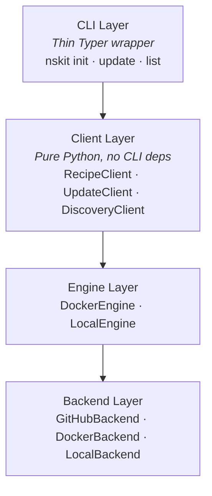
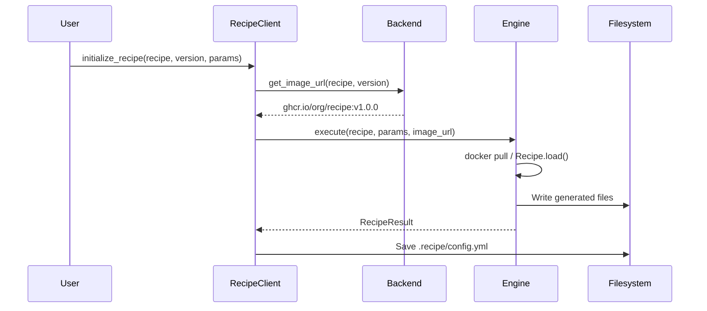
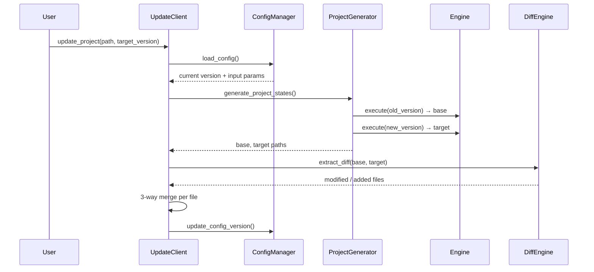

# Architecture Overview

## Design Goals

nskit is built around three principles:

1. **Composable recipes** — Recipes are assembled from reusable ingredients that can be shared across an organisation. When a shared ingredient improves, every recipe using it benefits.
2. **Reproducible updates** — When a recipe releases a new version, users should be able to adopt it without losing their customisations. This requires deterministic regeneration of past recipe outputs.
3. **Separation of concerns** — Recipe discovery, execution, and distribution are independent. You can swap backends or engines without changing recipes.

## Architecture Sections

| Section | What It Covers |
|---------|---------------|
| [Recipes](recipes.md) | Composition model — how ingredients, templates, and inheritance let you build a library of reusable project patterns |
| [The Mixer](mixer.md) | Template engine — Files, Folders, Hooks, context resolution, and Jinja2 rendering |
| [Docker vs Local Execution](docker-execution.md) | Execution engines — why Docker mode enables reliable updates and when to use local mode |

## System Layers



Each layer depends only on the one below it. The CLI is a thin wrapper — all logic lives in the client layer, which can be used directly from Python or wrapped in a web API.

## Key Design Decisions

### Why Two Engines?

Recipes can execute in Docker containers or directly from installed Python packages. The choice affects whether updates are reliable — see [Docker vs Local Execution](docker-execution.md) for the detailed trade-offs.

### Why 3-Way Merge?

A 2-way diff (current vs new) can't distinguish between "the user changed this" and "the recipe changed this". A 3-way merge compares three states:

- **Base** — what the recipe originally generated (regenerated from the pinned version)
- **Current** — the user's project with customisations
- **Target** — what the new recipe version generates

This lets nskit apply recipe updates while preserving user changes, and only flag conflicts where both sides modified the same code.

### Why Separate Backends from Engines?

**Backends** handle discovery: "what recipes exist and what versions are available?" **Engines** handle execution: "run this recipe and produce files." Separating them means:

- A `GitHubBackend` can discover recipes from GitHub Releases but execute them via Docker
- A `LocalBackend` can list recipes from a directory for development
- Custom backends (S3, Artifactory, etc.) can be added without changing execution logic

### Why a Client Layer?

The client layer is pure Python with no CLI framework dependencies. This means:

- The CLI is a thin wrapper that can be replaced or customised
- The same logic works in a web API, a CI script, or a Jupyter notebook
- Testing doesn't require invoking CLI commands

## Data Flow: Init



## Data Flow: Update (3-Way)



## Configuration: .recipe/config.yml

Every recipe-generated project stores metadata in `.recipe/config.yml`:

```yaml
input:
  name: my-project
  repo:
    owner: My Team
    email: team@example.com
metadata:
  recipe_name: python_package
  docker_image: ghcr.io/myorg/python_package:v1.0.0
  created_at: '2026-01-15T10:30:00+00:00'
  updated_at: '2026-03-20T14:00:00+00:00'
```

This stores the original input parameters (so the base can be regenerated) and the Docker image URL (so the exact version can be pulled).
