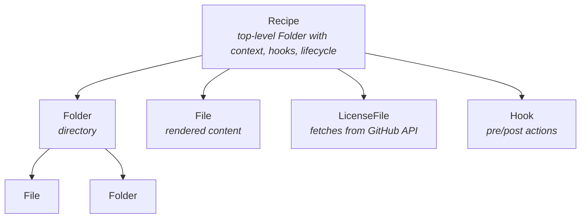

# The Mixer

The mixer is nskit's template engine — the layer that turns recipe definitions into files on disk.

## Core Components



### File

A file with content that gets rendered through Jinja2:

```python
from nskit.mixer.components import File

# Inline content (rendered as Jinja2)
File(name="README.md", content="# {{name}}\n")

# Template from a package resource (loaded via importlib.resources)
File(name="pyproject.toml", content="my_package:pyproject.toml.jinja")

# Dynamic name (also a Jinja2 template)
File(name="{{script_name}}.py", content="print('hello')")
```

Content strings in `package:filename` format are loaded from the package's files using `importlib.resources`, then rendered as Jinja2 templates. Plain strings are rendered directly.

### Folder

A directory containing Files and other Folders:

```python
from nskit.mixer.components import Folder, File

Folder(name="src", contents=[
    Folder(name="{{repo.src_path}}", contents=[
        File(name="__init__.py", content="..."),
    ]),
])
```

Folder and file names are Jinja2 templates, so they can use context variables.

### Recipe

A Recipe is a Folder with additional capabilities:

- **Context** — Pydantic model fields become template variables automatically
- **Pre/post hooks** — Actions that run before/after file generation (e.g. `git init`)
- **Lifecycle methods** — `create()`, `dryrun()`, `validate()`
- **Entry point discovery** — `Recipe.load('name')` finds recipes via Python entry points

```python
from nskit.mixer.components import Recipe, File

class MyRecipe(Recipe):
    name: str = "my-project"
    author: str = "Team"

    contents = [
        File(name="README.md", content="# {{name}}\nBy {{author}}\n"),
    ]
```

The `name` and `author` fields are automatically available in templates as `{{name}}` and `{{author}}`.

### Hook

Pre and post hooks run actions around file generation:

```python
from nskit.mixer.hooks.git import GitInit
from nskit.mixer.hooks.pre_commit import PrecommitInstall

class MyRecipe(Recipe):
    pre_hooks = []                    # Run before writing files
    post_hooks = [GitInit(), PrecommitInstall()]  # Run after
```

## Template Resolution

When a File's content is a string like `"my_package:template.jinja"`, the mixer resolves it in two steps:

1. **Resource loading** — `importlib.resources` locates the file within the installed Python package
2. **Jinja2 rendering** — The loaded content is rendered with the recipe's context variables

Template inheritance (``) uses the same resolution — the parent template is loaded from its package resource path.

## Context

A recipe's context is built automatically from its Pydantic model:

```python
class MyRecipe(Recipe):
    name: str = "pkg"
    repo: RepoMetadata = Field(...)

    @property
    def custom_value(self):
        return "computed"
```

Available in templates as `{{name}}`, `{{repo.owner}}`, `{{custom_value}}`, and `{{recipe.name}}`, `{{recipe.version}}`.
