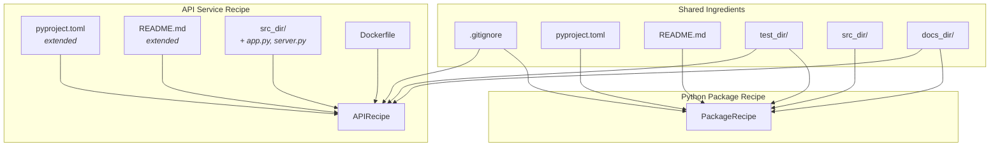
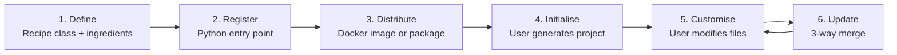

# Recipe Architecture

## The Composition Model

nskit recipes are not monolithic templates. They're assembled from small, reusable pieces called **ingredients** — individual files, folders, and Jinja2 templates — that can be shared, extended, and overridden.



### Ingredients Are Reusable

An ingredient is just a `File` or `Folder` instance. The same ingredient can appear in multiple recipes:

```python
# Shared ingredients
from nskit.recipes.python import ingredients

# Python package recipe — uses shared ingredients directly
class PackageRecipe(PyRecipe):
    contents = [
        ingredients.gitignore,
        ingredients.pyproject_toml,
        ingredients.readme_md,
        ingredients.test_dir,
        ingredients.src_dir,
        ingredients.docs_dir,
    ]

# API service recipe — same shared ingredients + extras
class APIRecipe(PyRecipe):
    contents = [
        ingredients.gitignore,
        api_ingredients.pyproject_toml,   # extended version
        api_ingredients.readme_md,        # extended version
        ingredients.test_dir,
        api_ingredients.src_dir,          # adds app.py, server.py
        docker_ingredients.dockerfile,    # API-specific
        docker_ingredients.docker_ignore, # API-specific
        ingredients.docs_dir,
    ]
```

When the shared `gitignore` ingredient improves, both recipes get the update.

### Templates Support Inheritance

Jinja2 template inheritance lets specialised recipes extend base templates without duplicating them:

```jinja
{# api/pyproject.toml.jinja — extends the base #}



    {{ super() }}
    "fastapi",
    "uvicorn",

```

The base `pyproject.toml.jinja` defines the full structure with extension blocks. The API version only overrides the dependencies block, inheriting everything else.

### Recipes Extend Recipes

Python class inheritance works naturally:

```python
class PyRecipe(CodeRecipe):
    """Base for all Python recipes — adds repo metadata, naming conventions."""
    repo: PyRepoMetadata = Field(...)

class PackageRecipe(PyRecipe):
    """Adds package-specific ingredients."""
    contents = [...]

class APIRecipe(PyRecipe):
    """Adds API-specific ingredients on top of the same base."""
    contents = [...]
```

### Ingredients Can Be Modified

Ingredients are Pydantic models, so they can be deep-copied and extended:

```python
# Start with the shared src_dir
src_dir = ingredients.src_dir.model_copy(deep=True)

# Add API-specific files to it
src_dir['src_path'].contents += [
    File(name='app.py', content='my_recipe:app.py.jinja'),
    File(name='server.py', content='my_recipe:server.py.jinja'),
]
```

This lets you build on shared structure without modifying the original.

## Recipe Lifecycle



## Why This Matters for Organisations

A platform team can maintain:

- **Common ingredients** — CI pipelines, linting config, Docker templates, security policies
- **Language-specific bases** — Python package, Go service, Terraform module
- **Team-specific recipes** — Composed from common + language ingredients + team overrides

When a security policy changes, update the shared ingredient once. Every recipe that uses it picks up the change. Every project built from those recipes can adopt it via 3-way merge update.
