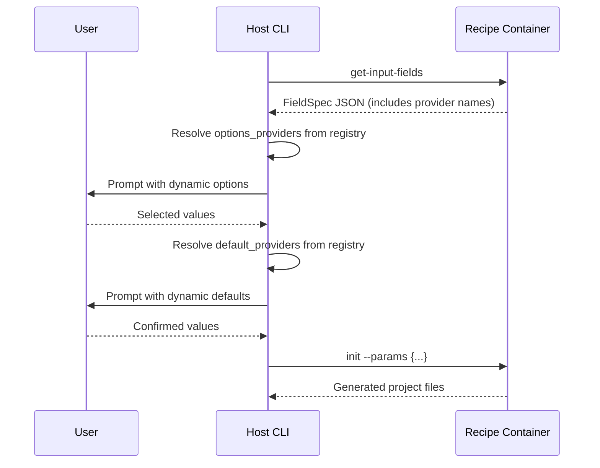

# Field Providers

Field providers let recipes declare that a field's options or default should be resolved dynamically at prompt time by calling out to external tools or APIs — without baking the resolution logic (or credentials) into the recipe itself.

## The Challenge

Some fields need values that come from external systems at runtime:

- Available domain names from an AWS Organisation's account structure
- Team names from an identity provider
- Account IDs resolved by calling a platform API
- Defaults derived from an external lookup based on a previous answer

These can't be solved with standard Pydantic patterns:

- **Static `options=["a", "b"]`** — values aren't known at definition time
- **`Enum` annotation** — same issue; enum members are fixed at class definition. You'd need the full list of valid values baked into the recipe code, and a code change every time the source of truth changes
- **`default_factory`** — runs at model instantiation, not at prompt time. It also runs unconditionally (even in tests), can't access previously collected field values, and requires credentials to be available at import/instantiation time
- **Calling an API at import time** — fragile, breaks `--help`, breaks tests, requires auth at module load

## When to Use What

| Mechanism | Use for |
|-----------|---------|
| Static `options` / `Enum` / `Literal` | Fixed, known-at-definition-time choices (regions, languages, licence types) |
| `default_factory` (standard Pydantic) | Computed defaults that need no external calls — timestamps, UUIDs, mutable containers |
| `env_var` | Defaults sourced from the user's environment |
| `template` | Defaults derived from other collected field values via Jinja2 |
| **`options_provider`** | Choices fetched from an external API/tool at prompt time |
| **`default_provider`** | Defaults fetched from an external API/tool at prompt time, potentially using previously collected values |

Providers are specifically for the case where resolution requires **calling out to an external system** — an API, a CLI tool, a database, an organisation directory. If you just need a mutable default or a value computed from other fields, use `default_factory` or `template` respectively.

## Platform Implementation

When you control both the recipe package and the executor (CLI plugin), you own the full contract. This is the typical setup for an internal platform team: one repo defines the recipes, another ships the CLI that runs them.

The workflow:

1. **Recipe repo** — declares provider names on fields. These are part of the recipe's public contract, same as field names and types.
2. **CLI plugin repo** — registers provider implementations that have access to platform credentials, org APIs, and internal tooling.
3. **Both repos agree on provider names** — document them, version them, fail loudly on mismatch.

### Example: paebbl platform

```python
# nskitchen (recipe repo) — recipe declares what it needs
class DockerServiceRecipe(BasePythonRecipe):
    domain: str = RecipeField(
        options_provider="paebbl_domains",
        description="Target deployment domain",
    )
    domain_accounts: PaebblLZV2DomainAccountsMetadata = RecipeField(
        default_provider="paebbl_domain_accounts",
        description="AWS account IDs for the domain (resolved from selection)",
    )
```

```python
# paebbl-cli-recipes (executor repo) — provides the implementation
from paebbl.platform.sdk import OrgClient

def get_paebbl_domains() -> list[str]:
    """Fetch available domains from the platform org API."""
    return OrgClient().list_domain_names()

def get_domain_accounts(collected_values: dict) -> dict | None:
    """Look up dev/acc/prod account IDs for the selected domain."""
    domain = collected_values.get("domain")
    if not domain:
        return None
    accounts = OrgClient().get_domain_accounts(domain)
    return {
        "dev_account_id": accounts.dev,
        "acc_account_id": accounts.acc,
        "prod_account_id": accounts.prod,
    }

# Registered at CLI startup
PLATFORM_OPTIONS_PROVIDERS = {
    "paebbl_domains": get_paebbl_domains,
}
PLATFORM_DEFAULT_PROVIDERS = {
    "paebbl_domain_accounts": get_domain_accounts,
}
```

### Managing the contract

Since both sides are under your control, enforce the contract explicitly:

```python
# In the CLI plugin's handler setup
from paebbl.platform.builder.nskitchen.providers import REQUIRED_PROVIDERS

missing = REQUIRED_PROVIDERS - (
    set(PLATFORM_OPTIONS_PROVIDERS) | set(PLATFORM_DEFAULT_PROVIDERS)
)
if missing:
    raise RuntimeError(
        f"Recipe providers not registered in CLI: {missing}. "
        "Update paebbl-cli-recipes to match nskitchen's requirements."
    )
```

Define `REQUIRED_PROVIDERS` in the recipe repo so the CLI can validate at import time. A CI check in the CLI repo can catch drift before release.

### Testing in isolation

Each side tests independently:

```python
# Recipe repo tests — stub providers, verify field declarations work
handler = InteractiveHandler(
    options_providers={"paebbl_domains": lambda: ["test-domain"]},
    default_providers={"paebbl_domain_accounts": lambda cv: {
        "dev_account_id": "111111111111",
        "acc_account_id": "222222222222",
        "prod_account_id": "333333333333",
    }},
)

# CLI repo tests — mock the SDK, verify providers return correct shapes
@patch("paebbl.platform.sdk.OrgClient")
def test_get_paebbl_domains(mock_client):
    mock_client.return_value.list_domain_names.return_value = ["analytics"]
    assert get_paebbl_domains() == ["analytics"]
```

### Integration test

A single integration test confirms both sides agree:

```python
def test_provider_contract():
    """All providers declared by recipes are registered in the CLI."""
    from paebbl.platform.builder.nskitchen.providers import REQUIRED_PROVIDERS
    from paebbl.cli.plugins.recipes.providers import (
        PLATFORM_DEFAULT_PROVIDERS,
        PLATFORM_OPTIONS_PROVIDERS,
    )
    registered = set(PLATFORM_OPTIONS_PROVIDERS) | set(PLATFORM_DEFAULT_PROVIDERS)
    assert REQUIRED_PROVIDERS <= registered
```

## The Model

Recipes declare **what** they need. Runners provide **how** to get it.

```
┌─────────────────────────┐           ┌────────────────────────────┐
│  Recipe                 │           │  Runner (CLI / Platform)   │
│                         │           │                            │
│  domain: str =          │  string   │  options_providers={       │
│    RecipeField(         │  ──────►  │    "org_domains":          │
│      options_provider=  │  contract │      fetch_domains,        │
│        "org_domains"    │           │  }                         │
│    )                    │           │                            │
│                         │           │  default_providers={       │
│  account_id: str =      │           │    "domain_account_id":    │
│    RecipeField(         │           │      lookup_account_id,    │
│      default_provider=  │           │  }                         │
│        "domain_account_id"          │                            │
│    )                    │           │                            │
└─────────────────────────┘           └────────────────────────────┘
```

The contract between the two sides is a **string name**. The recipe uses the name; the runner registers a callable under that name.

## Why Not a Direct Callable?

Three reasons:

1. **Serialisability** — `FieldSpec` is serialised to JSON when recipes run in Docker containers. Callables can't be serialised; string names can.

2. **Security** — recipes are authored by various teams. Giving recipe code credential access (to call APIs directly) is an arbitrary code execution surface. The runner is trusted; the recipe is not.

3. **Testability** — recipe tests don't need AWS mocks or API stubs. Pass `options_providers={"org_domains": lambda: ["fake"]}` and the recipe works.

## Options Providers

An options provider populates the choices for a field at prompt time.

### Recipe side

```python
from nskit.mixer.components.recipe import Recipe, RecipeField

class MyRecipe(Recipe):
    domain: str = RecipeField(
        options_provider="org_domains",
        description="Target deployment domain",
        display_name="Domain",
    )
```

No static `options` needed. The field type is automatically promoted to `ENUM` when the provider returns a non-empty list.

### Runner side

```python
from nskit.client.interactive import InteractiveHandler

def fetch_domains() -> list[str]:
    """Call org API to get available domain names."""
    # Your implementation here — AWS Organizations, config file, etc.
    return ["analytics", "genomics", "platform"]

handler = InteractiveHandler(
    options_providers={
        "org_domains": fetch_domains,
    },
)
```

### Provider signature

Options providers are called with two arguments: `(field, default)`. If your provider doesn't need them, a no-arg function works — the handler falls back to calling it without arguments.

```python
# Full signature — receives the FieldSpec and resolved default
def provider_with_context(field: FieldSpec, default: Any) -> list[str]:
    return ["a", "b", "c"]

# Simple signature — no arguments needed
def simple_provider() -> list[str]:
    return ["a", "b", "c"]
```

### Behaviour

| Scenario | Result |
|----------|--------|
| Provider registered and returns `["a", "b"]` | Field becomes an ENUM choice prompt |
| Provider registered and returns `[]` | Field stays as text input (no promotion) |
| Provider not registered | Field stays as text input, warning logged |
| Provider raises an exception | Exception swallowed, field stays as text input |
| Field already has static `options` | Provider is not called |

## Default Providers

A default provider computes a field's default value at prompt time, using previously collected values.

### Recipe side

```python
class MyRecipe(Recipe):
    domain: str = RecipeField(
        options_provider="org_domains",
        description="Target domain",
    )
    account_id: str = RecipeField(
        default_provider="domain_account_id",
        description="AWS account ID (resolved from domain)",
    )
```

### Runner side

```python
def lookup_account_id(collected_values: dict[str, Any]) -> str | None:
    """Look up account ID from the selected domain."""
    domain = collected_values.get("domain")
    if not domain:
        return None
    # Your implementation here
    return DOMAIN_ACCOUNT_MAP.get(domain)

handler = InteractiveHandler(
    options_providers={"org_domains": fetch_domains},
    default_providers={"domain_account_id": lookup_account_id},
)
```

### Provider signature

Default providers receive the dictionary of previously collected field values:

```python
def my_default_provider(collected_values: dict[str, Any]) -> Any:
    """Return the default value, or None to fall through."""
    ...
```

### Resolution priority

Default providers sit in the resolution chain between template expressions and static defaults:

1. `env_var` — environment variable (highest priority)
2. `template` — Jinja2 expression against collected values
3. `default_provider` — callable that hits an external API/tool with collected values
4. Static `default` — value on the field (lowest priority)

If a higher-priority source returns a value, the provider is never called.

Note: Pydantic's `default_factory` is **not** part of this chain. A `default_factory` runs at model instantiation time (when the recipe object is created), not during interactive field collection. Use `default_factory` for things like `default_factory=list` or `default_factory=uuid4` — values that need no external calls. Use `default_provider` when you need to call an API or tool and can benefit from seeing what the user already entered.

| Scenario | Result |
|----------|--------|
| Provider returns a value | Used as the default (user can still override) |
| Provider returns `None` | Falls through to static default |
| Provider raises an exception | Exception swallowed, falls through to static default |
| Provider not registered | Falls through to static default, no error |

## Combining Options and Default Providers

A common pattern: one field picks from a dynamic list, and a dependent field auto-resolves from the selection.

```python
class InfraRecipe(Recipe):
    domain: str = RecipeField(
        options_provider="org_domains",
        description="Target domain",
    )
    dev_account_id: str = RecipeField(
        default_provider="domain_dev_account",
        description="DEV account ID",
    )
    prod_account_id: str = RecipeField(
        default_provider="domain_prod_account",
        description="PROD account ID",
    )
```

```python
handler = InteractiveHandler(
    options_providers={
        "org_domains": lambda: get_org_domains(),
    },
    default_providers={
        "domain_dev_account": lambda cv: get_accounts(cv.get("domain"), "dev"),
        "domain_prod_account": lambda cv: get_accounts(cv.get("domain"), "prod"),
    },
)
```

The user picks a domain from a list, then account IDs auto-populate as defaults. They can still override if needed.

## Docker Execution

When recipes run inside Docker containers (the recommended production mode), providers work differently:

1. The container runs `get-input-fields` and returns `FieldSpec` as JSON — including the `options_provider` and `default_provider` string names.
2. The **host-side** runner (e.g. your CLI) receives the JSON and resolves providers from its own registry before prompting the user.
3. Collected values are passed back to the container for recipe execution.

The container never calls providers. It only declares them. This keeps credentials on the host where they belong.



## Testing Recipes with Providers

Recipe tests don't need real provider implementations. Pass stubs:

```python
class TestMyRecipe(unittest.TestCase):
    def test_field_collection(self):
        handler = InteractiveHandler(
            options_providers={"org_domains": lambda: ["test-domain"]},
            default_providers={"domain_account_id": lambda cv: "123456789012"},
        )
        fields = FieldParser().from_recipe_model(MyRecipe)
        result = handler.collect_field_values(
            fields, pre_filled={"name": "test", "domain": "test-domain"}
        )
        self.assertEqual(result["account_id"], "123456789012")
```

## Registering Providers in a Platform CLI

If you wrap nskit in a platform CLI (see [Platform Integration](platform-integration.md)), register providers when creating the handler:

```python
# myplatform_cli/providers.py
from myplatform.sdk import OrgClient

def get_org_domains() -> list[str]:
    return OrgClient().list_domains()

def get_domain_account(collected_values: dict) -> str | None:
    domain = collected_values.get("domain")
    return OrgClient().get_account_id(domain) if domain else None

PROVIDERS = {
    "options": {"org_domains": get_org_domains},
    "defaults": {"domain_account_id": get_domain_account},
}
```

```python
# myplatform_cli/app.py
from nskit.cli.app import create_cli
from myplatform_cli.providers import PROVIDERS

handler = InteractiveHandler(
    options_providers=PROVIDERS["options"],
    default_providers=PROVIDERS["defaults"],
)
```

## Graceful Degradation

Providers are optional. If the runner doesn't register a provider that a recipe declares:

- **Options provider missing** — field renders as a text input instead of a dropdown. The user types the value manually.
- **Default provider missing** — field falls through to its static default (or no default). The user is prompted normally.

This means that recipes remain usable even with a minimal runner that has no providers registered.

To catch mismatches early, validate at startup:

```python
EXPECTED_PROVIDERS = {"org_domains", "domain_account_id"}
registered = set(handler.options_providers) | set(handler.default_providers)
missing = EXPECTED_PROVIDERS - registered
if missing:
    logger.warning("Unregistered providers: %s — dynamic resolution unavailable", missing)
```
