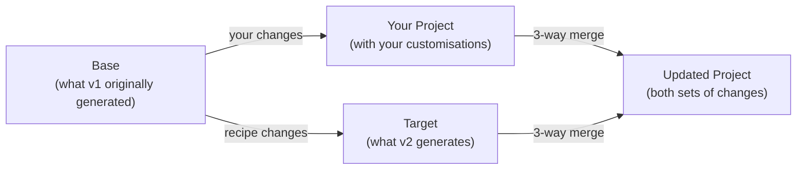
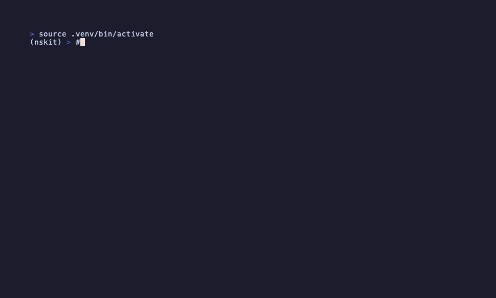

# Updating from a Recipe

Your project was generated from a recipe. The recipe has a new version. Here's how to get the good stuff without losing your changes.

## How It Works

nskit compares three states to figure out what changed and who changed it:



nskit regenerates the base and target from the recipe, then 3-way merges them against your current files. Your changes survive. Recipe improvements land. Conflicts get flagged — not hidden.

!!! warning "Docker mode required for reliable updates"
    The merge depends on regenerating the exact base output. See [Docker vs Local Execution](../architecture/docker-execution.md) for why this matters.

## The Steps



```bash
# 1. Make sure your working tree is clean (nskit will refuse otherwise)
git status

# 2. See what would change before committing to anything
nskit update --dry-run

# 3. Pull the trigger
nskit update --target-version v2.0.0

# 4. Check the results, resolve any conflicts, commit
git diff
git add .
git commit -m "Update recipe to v2.0.0"
```

## What Happens to Each File

| Scenario | Result |
|----------|--------|
| Only you changed it | Your version kept — the recipe doesn't touch it |
| Only the recipe changed it | New version applied automatically |
| Both changed different parts | Merged — you get both sets of changes |
| Both changed the same lines | Conflict markers inserted — your call |
| Recipe added a new file | File appears in your project |
| You deleted a file the recipe still has | Stays deleted — nskit respects your choice |

## Resolving Conflicts

Standard git conflict markers. Nothing exotic:

```bash
git status              # Which files?
# Edit the <<<<<<< / ======= / >>>>>>> markers
git add .
git commit -m "Resolved conflicts"
```

## 2-Way Mode (The Nuclear Option)

Don't care about preserving your changes? 2-way mode just overwrites everything with the new recipe output:

```bash
nskit update --diff-mode two-way
```

Useful for resetting a project to a clean recipe state. Less useful if you've spent a week customising things.

## The .recipe Directory

nskit tracks what it needs in `.recipe/config.yml`:

```yaml
input:
  name: my-project
  repo:
    owner: My Team
    email: team@example.com
metadata:
  recipe_name: python_package
  docker_image: ghcr.io/myorg/python_package:v1.0.0
  created_at: '2026-01-15T10:30:00+00:00'
  updated_at: '2026-03-20T14:00:00+00:00'
```

The `input` is replayed to regenerate the base and target states. The `docker_image` tells nskit exactly which container to pull. Don't delete this file.

## Programmatic Usage

```python
from nskit.client import UpdateClient
from nskit.client.diff.models import DiffMode
from pathlib import Path

update_client = UpdateClient(backend, engine=engine)

# Check
latest = update_client.check_update_available(Path('./my-project'))

# Update
result = update_client.update_project(
    project_path=Path('./my-project'),
    target_version=latest,
    diff_mode=DiffMode.THREE_WAY,
)

print(f"Updated: {result.files_updated}")
print(f"Conflicts: {result.files_with_conflicts}")
```

## Troubleshooting

- **"Project has uncommitted changes"** — commit or stash first. nskit won't merge into a dirty tree.
- **"Project is not a git repository"** — nskit needs git for the merge. Run `git init` and commit.
- **"Recipe configuration missing metadata"** — `.recipe/config.yml` is missing or broken. You may need to re-initialise.
