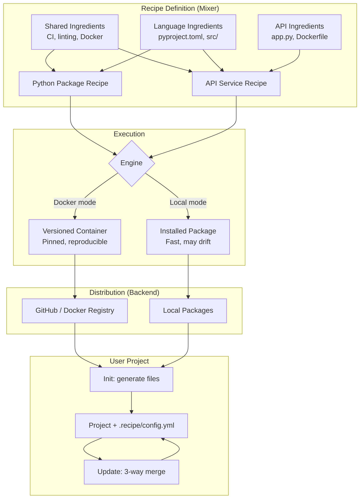

# nskit

A Python toolkit for creating and managing projects from composable, template-based recipes — with intelligent 3-way merge updates.

## Why nskit?

Most scaffolding tools generate your project and disappear. Six months later the template has better CI, updated dependencies, and a security fix — but you're left playing "spot the diff" across a hundred files. Good luck.

It gets worse at scale. If your organisation has ten project types, you're maintaining ten copies of your CI pipeline, linting config, and Docker setup. Change one, forget the other nine.

nskit takes a different approach:

- **Recipes are composable.** This is the big one. Recipes are assembled from reusable ingredients — files, folders, and Jinja2 templates — that can be shared, extended, and overridden. Your CI config lives in one place. Your linting setup lives in one place. A Python package recipe and an API service recipe both pull from the same shared ingredients. Update the ingredient, and every recipe gets it.
- **Recipes are versioned.** Each release is a pinned Docker image. v1.0.0 today produces the same output as v1.0.0 next year. No surprises.
- **Updates preserve your work.** A 3-way merge compares what the recipe originally generated, what you've changed, and what the new version produces — then combines them. Your custom README intro survives the update. The new CI pipeline lands automatically.
- **Conflicts are honest.** When both you and the recipe changed the same lines, nskit tells you with standard merge markers instead of silently picking a winner.

Platform teams maintain shared ingredients centrally. Individual teams compose their own recipes from those ingredients — or build new ones from scratch. Developers get updates without losing their work. Everyone sleeps better.

## Quick Start

```bash
pip install nskit

# Initialise a project (Docker mode)
nskit init --recipe python_package

# Check for updates
nskit check

# Update (3-way merge)
nskit update
```

With GitHub backend: `pip install nskit[github]`

## Guides

| Guide | Who it's for |
|-------|-------------|
| [Using a Recipe](guides/using-a-recipe.md) | "I want to generate a project and keep it updated" |
| [Updating from a Recipe](guides/updating-from-a-recipe.md) | "How does the merge actually work?" |
| [Building a Recipe](guides/building-a-recipe.md) | "I want to create recipes for my team" |
| [Working with Namespaces](guides/namespaces.md) | "I need to enforce naming conventions across repos" |
| [Platform Integration](guides/platform-integration.md) | "I want to embed nskit in our developer platform" |

## How It Works

Recipes are built from composable ingredients using the **mixer**, then executed and managed through the **client layer**:



**Docker mode** (recommended) pins each recipe version as an immutable container image — nskit can regenerate any past version exactly when computing merges. **Local mode** runs from installed Python packages, which is faster but may produce inconsistent results if the environment changes.

See [Architecture](architecture/index.md) for the full design rationale.
